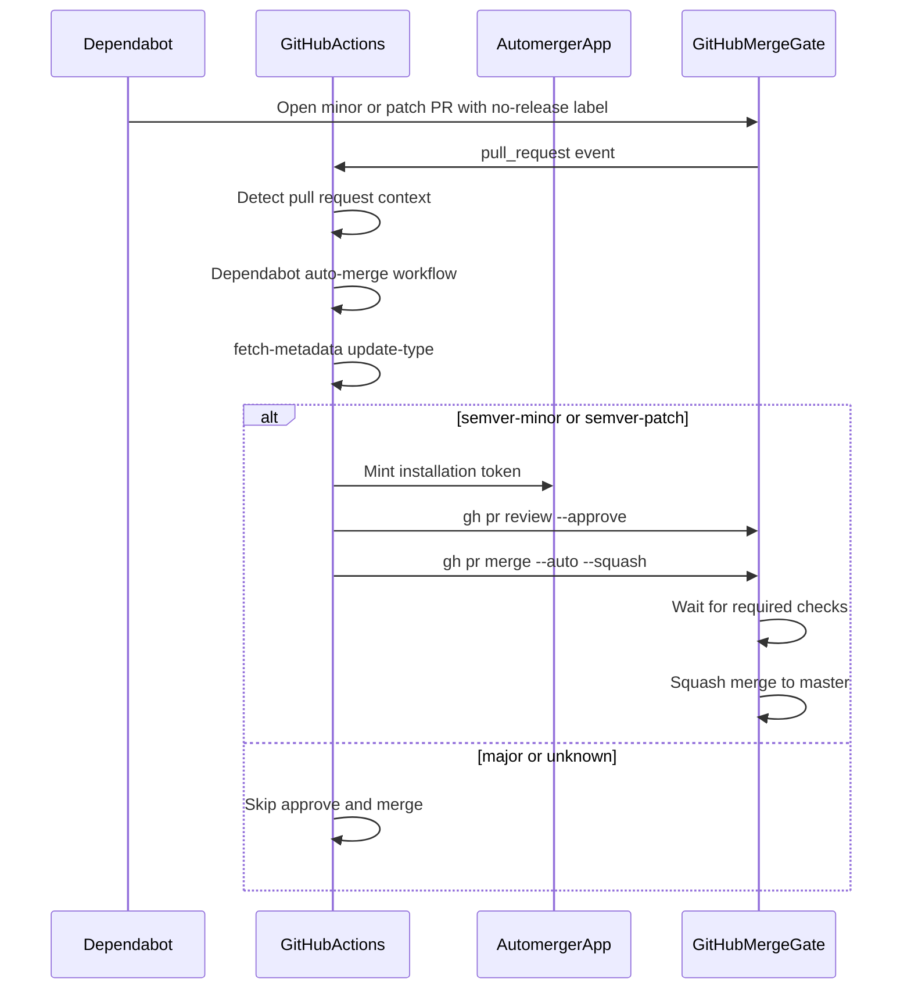
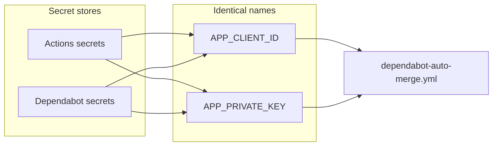

# Dependabot automation

Minor and patch Dependabot pull requests are approved and squash-merged by the `automerger` GitHub App after required CI passes. Major and non-semver updates stay open for manual review.

See [ADR-001](decisions/001-dependabot-auto-merge.md) for why a GitHub App is used and why code-owner reviews are **not** a merge gate.

## How it works

What gets auto-merged:

- `version-update:semver-minor`
- `version-update:semver-patch`

What stays manual:

- `version-update:semver-major`
- `version-update:semver-unknown`
- Any PR not authored by `dependabot[bot]`

`--auto` does **not** wait inside the job. GitHub merges later, only if branch protection is satisfied. If required status checks are missing, GitHub can squash-merge as soon as the App approves.

## Repository files

- [`.github/workflows/dependabot-auto-merge.yml`](../.github/workflows/dependabot-auto-merge.yml) — approve + enable squash auto-merge
- [`.github/dependabot.yml`](../.github/dependabot.yml) — terraform (weekly) and github-actions (daily); labels `no-release` and `dependencies`
- [`.github/CODEOWNERS`](../.github/CODEOWNERS) — review requests to `@ealebed` (not a merge requirement)

The auto-merge workflow never checks out the pull request branch.

CI ([`ci-test-and-prepare-release.yaml`](../.github/workflows/ci-test-and-prepare-release.yaml)) fails unless the PR has **exactly one** of `major` / `minor` / `patch` / `no-release`. Dependabot therefore keeps `no-release` and must not also get another release-type label. `dependencies` is extra and does not count as a release type.

## GitHub App

App: `automerger` (user-owned). Webhook disabled. Installed on selected repositories.

Repository permissions:

- **Contents**: Read and write (merge)
- **Pull requests**: Read and write (approve, enable auto-merge)
- **Metadata**: Read-only (required)

The workflow mints a short-lived installation token with [`actions/create-github-app-token@v3`](https://github.com/actions/create-github-app-token) using **Client ID** + private key PEM. Do not use an OAuth client secret.

These secrets are **not** `TF_MODULES_APP_ID` / `TF_MODULES_APP_PRIVATE_KEY` (those are for module validate, wiki, and release dispatch).

[Making authenticated API requests with a GitHub App in a workflow](https://docs.github.com/en/apps/creating-github-apps/authenticating-with-a-github-app/making-authenticated-api-requests-with-a-github-app-in-a-github-actions-workflow)

## Secrets

Dependabot-triggered `pull_request` jobs only see **Dependabot** secrets, not Actions secrets or variables. Store the **same names** in both stores:

| Name | Store | Value |
| --- | --- | --- |
| `APP_CLIENT_ID` | Actions **and** Dependabot secrets | GitHub App Client ID (`Iv1…` / `Iv23…`) |
| `APP_PRIVATE_KEY` | Actions **and** Dependabot secrets | Full PEM, including BEGIN/END lines |

If a Dependabot run fails with an empty Client ID or private key, the values were added only under Actions secrets.

## Branch protection (`master`)

Required so auto-merge cannot skip CI:

- Require a pull request before merging
- Required approving reviews: **1**
- **Do not** require review from Code Owners
- Dismiss stale reviews when new commits are pushed (the workflow re-approves on `synchronize`)
- Require status checks to pass before merging
- Required check that always runs: `Detect pull request context` (from [CI/test and prepare release](../.github/workflows/ci-test-and-prepare-release.yaml)). GitHub Actions-only Dependabot PRs skip `validate` / `lint` / `analysis` / `plan` because they only touch `.github/`. Module PRs also run matrix checks such as `validate (google-folder) / validate`.
- Do **not** require `Dispatch release event` or `Comment on PR`.
- Require conversation resolution: **off**
- Allow auto-merge: **on**
- Squash merging: **on**
- No force pushes, no deletions

## Rollout order

App install, secrets, auto-merge, squash, and branch protection (including required check `Detect pull request context`) are already configured for this repository. Merge the workflow into `master` last so a minor/patch Dependabot PR cannot merge before required checks finish.

## Verify

1. Minor or patch Dependabot PR with only `no-release` (plus optional `dependencies`): App approval, auto-merge queued, squash merge after `Detect pull request context` is green.
2. Major or `semver-unknown` Dependabot PR: workflow runs, no App approval, PR stays open.
3. Human PR: workflow job skipped (`dependabot[bot]` guard).
4. On a Dependabot-triggered run, `Create GitHub App token` can read both secrets.
5. A Dependabot PR that also has `minor` / `major` / `patch` will fail Detect (two release-type labels). Remove the extra release label.
